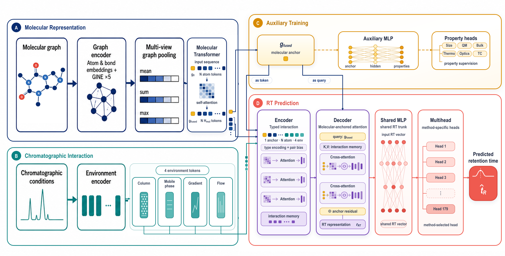

# FUSE-RT

FUSE-RT is a multimodal framework for liquid-chromatography retention-time prediction that jointly represents molecular graphs and chromatographic conditions. This repository provides the E1–E9 factorial experiments, RadonPy auxiliary-data scaling experiments, molecule-disjoint internal testing, held-out-method internal out-of-distribution (OOD) evaluation, external OOD evaluation, and reproduced Uni-RT and Graphormer-RT baselines.

## Model

The molecular branch converts each SMILES string into an atom–bond graph and derives a molecular representation through GINE message passing, graph-level aggregation, and a molecular Transformer. The chromatographic branch independently encodes the stationary phase, mobile-phase composition, gradient program, and flow rate. A typed-interaction Transformer and retention-time query decoder perform cross-modal fusion before prediction with either a shared single head or method-specific multiple heads. RadonPy molecular properties are incorporated through the shared molecular encoder and an auxiliary property-prediction head.



## Data and splits

Retention times, molecular structures, and chromatographic metadata are derived from [`michaelwitting/RepoRT`](https://github.com/michaelwitting/RepoRT). The source dataset is described in: Kretschmer F, Boesl F, Bronsert P, et al. *RepoRT: a comprehensive repository for small molecule retention times*. Nature Methods. 2024;21:153–155. [doi:10.1038/s41592-023-02143-z](https://doi.org/10.1038/s41592-023-02143-z).

The 179-method training cohort is constructed as follows:

| Stage | Methods |
|---|---:|
| Strict RP, constant flow, binary A/B mobile phase, at least 50 RT observations, and RadonPy overlap above 50% | 190 |
| Valid gradient information | 178 |
| Hold out methods `0097` and `0238` | 176 |
| Add methods `0053`, `0069`, and `0126` | 179 |

The internal OOD benchmark consists exclusively of held-out methods `0097` and `0238`. Training, validation, and internal-test partitions use full InChIKeys to construct molecule-disjoint 60/20/20 splits with seeds `2004, 2006, 2011, 2012, 2016, 2020, 2022, 2027, 2032, 2034`. Method `0055` is retained under the frozen cohort definition; its flow-status decision and explicit override are documented in the selection audit.

## Experimental design

The molecular branch evaluates three training strategies. M0 uses no auxiliary labels. M1 pretrains on RadonPy properties before retention-time fine-tuning. M2 jointly optimizes the retention-time objective and a masked RadonPy property objective. The retention-time branch evaluates three architectures. R0 uses chromatographic metadata with a shared prediction head, R1 uses chromatographic metadata with method-specific heads, and R2 excludes chromatographic metadata while retaining method-specific heads.

| Experiment | Molecular training | RT architecture | Environment | RT head |
|---|---|---|---:|---|
| E1 | M0: no auxiliary objective | R0 | ✓ | single |
| E2 | M0: no auxiliary objective | R1 | ✓ | multi |
| E3 | M0: no auxiliary objective | R2 | — | multi |
| E4 | M1: sequential pretraining | R0 | ✓ | single |
| E5 | M1: sequential pretraining | R1 | ✓ | multi |
| E6 | M1: sequential pretraining | R2 | — | multi |
| E7 | M2: joint multitask training | R0 | ✓ | single |
| E8 | M2: joint multitask training | R1 | ✓ | multi |
| E9 | M2: joint multitask training | R2 | — | multi |

## Results

### Molecule-disjoint internal test

Results are reported as the mean ± sample standard deviation over the same 10 split seeds. Each internal-test split contains an average of 9,054.8 observations per seed.

| Experiment | MAE (s) ↓ | RMSE (s) ↓ | MAPE (%) ↓ | R² ↑ | Spearman ↑ |
|---|---:|---:|---:|---:|---:|
| E1 | 40.579 ± 2.920 | 98.820 ± 12.271 | 22.025 ± 3.414 | 0.9123 ± 0.0216 | 0.9482 ± 0.0075 |
| E2 | 37.359 ± 2.753 | 92.569 ± 11.056 | 20.362 ± 2.952 | 0.9233 ± 0.0179 | 0.9538 ± 0.0088 |
| E3 | 41.969 ± 3.156 | 97.144 ± 7.872 | 22.576 ± 3.359 | 0.9159 ± 0.0133 | 0.9496 ± 0.0063 |
| E4 | 39.903 ± 2.580 | 96.973 ± 11.877 | 21.068 ± 3.123 | 0.9156 ± 0.0215 | 0.9516 ± 0.0082 |
| E5 | 36.101 ± 2.140 | 88.885 ± 10.450 | 19.499 ± 3.191 | **0.9292 ± 0.0171** | 0.9568 ± 0.0088 |
| E6 | 36.321 ± 2.234 | 89.996 ± 9.316 | 19.741 ± 3.369 | 0.9275 ± 0.0163 | 0.9568 ± 0.0081 |
| E7 | 37.649 ± 2.551 | 94.219 ± 10.484 | 20.729 ± 3.061 | 0.9202 ± 0.0181 | 0.9533 ± 0.0070 |
| E8 | **36.099 ± 1.804** | 89.545 ± 7.918 | 19.222 ± 2.644 | 0.9281 ± 0.0148 | 0.9577 ± 0.0063 |
| E9 | 38.281 ± 5.468 | 92.676 ± 14.735 | 20.548 ± 3.558 | 0.9229 ± 0.0222 | 0.9555 ± 0.0106 |
| Graphormer-RT scratch-179 | 64.859 ± 5.135 | 149.366 ± 17.564 | — | 0.8007 ± 0.0423 | 0.9150 ± 0.0101 |

E8 achieves the lowest MAE and the best aggregate rank across the five evaluation metrics, whereas E5 achieves the highest R². Relative to the paired Graphormer-RT reproduction, E8 reduces MAE by 44.34% and RMSE by 40.05% and outperforms the baseline on all four shared metrics for each of the 10 split seeds.

### Auxiliary-data scaling

| RadonPy fraction | Point | MAE (s) ↓ | RMSE (s) ↓ | MAPE (%) ↓ | R² ↑ | Spearman ↑ |
|---:|---|---:|---:|---:|---:|---:|
| 0% | E2_zero | 37.359 | 92.569 | 20.362 | 0.9233 | 0.9538 |
| 0.05% | E8_p01 | 38.394 | 93.612 | 20.803 | 0.9215 | 0.9526 |
| 0.334370% | E8_p02 | 38.703 | 94.627 | 20.772 | 0.9202 | 0.9528 |
| 2.236068% | E8_p03 | 36.899 | 91.412 | 20.038 | 0.9254 | 0.9552 |
| 14.953488% | E8_p04 | **35.956** | 89.827 | 19.490 | 0.9280 | 0.9578 |
| 100% | E8_full | 35.958 | 89.282 | 19.217 | **0.9286** | 0.9578 |

Consistent gains emerge at 2.236068% auxiliary-data coverage and approach saturation near 14.953488%. The 14.953488% setting yields the lowest MAE, while full auxiliary-data coverage yields the highest R².

### Complete OOD analysis

The OOD evaluation comprises eight dataset-level analyses, two tier-level macro aggregates, and one global ALL-OOD aggregate. External OOD contains methods `0390, 0391, 0411, 0419, 0420, 0437`; internal OOD contains held-out methods `0097, 0238`. FUSE-RT and Graphormer-RT report method–seed macro averages over 10 paired seeds. Uni-RT uses one deterministic fixed-checkpoint result at K=0 and macro averages over the same 10 repeat seeds at K>0. For each feasible evaluation unit, the FUSE-RT configuration with complete method coverage and the lowest MAE is selected from E1–E9. E7 is additionally reported at K=0 and E8 at K>0 whenever the reference configuration differs from the MAE-optimal configuration. Slash-separated configurations and metrics follow the same order; for example, `E1/E7` denotes the MAE-optimal E1 result followed by E7, and `E5/E8` denotes the MAE-optimal E5 result followed by E8. `Methods (F/G/U)` gives the FUSE-RT, Graphormer-RT, and Uni-RT coverage, respectively. Within each comparison row, the lowest MAE and highest R² are shown in bold.

#### External OOD method `0390`

| K | Selected E | FUSE-RT MAE (s) | Graphormer MAE (s) | Uni-RT MAE (s) | FUSE-RT R² | Graphormer R² | Uni-RT R² |
|---:|---|---:|---:|---:|---:|---:|---:|
| 0 | E1/E7 | 173.846/190.656 | **80.417** | 211.444 | −7.1481/−8.5537 | **−0.4747** | −7.9465 |
| 5 | E8 | **46.788** | 53.482 | 269.374 | **0.3653** | 0.2285 | −73.9758 |
| 20 | E8 | **38.911** | 49.110 | 102.600 | **0.5234** | 0.3415 | −5.0181 |
| 100 | E8 | **31.705** | 40.397 | 73.585 | **0.6686** | 0.5355 | −15.6553 |
| 1000 | E8 | **24.167** | 31.509 | 40.558 | **0.8017** | 0.7050 | 0.4065 |

Graphormer-RT provides the lowest zero-shot MAE. Once task-specific support observations are introduced, FUSE-RT achieves the lowest MAE at every shared adaptation budget and improves from 46.788 s at K=5 to 24.167 s at K=1000.

#### External OOD method `0391`

| K | Selected E | FUSE-RT MAE (s) | Graphormer MAE (s) | Uni-RT MAE (s) | FUSE-RT R² | Graphormer R² | Uni-RT R² |
|---:|---|---:|---:|---:|---:|---:|---:|
| 0 | E1/E7 | 173.699/192.900 | **98.815** | 194.032 | −6.9979/−8.5470 | **−1.3594** | −6.5370 |
| 5 | E8 | **48.555** | 59.612 | 250.215 | **0.2885** | −0.0125 | −59.1117 |
| 20 | E5/E8 | **49.241**/50.355 | 54.793 | 120.665 | **0.2618**/0.2170 | 0.1379 | −4.8070 |
| 100 | E5/E8 | **40.425**/41.629 | 48.737 | 72.308 | **0.4834**/0.4530 | 0.3063 | −1.5676 |
| 1000 | E8 | **30.345** | 39.513 | 45.919 | **0.7097** | 0.5279 | 0.3279 |

FUSE-RT outperforms both baselines at every shared adaptation budget (K=5, 20, 100, and 1000), reaching its lowest MAE of 30.345 s with E8 at K=1000.

#### External OOD method `0411`

| K | Selected E | FUSE-RT MAE (s) | Graphormer MAE (s) | Uni-RT MAE (s) | FUSE-RT R² | Graphormer R² | Uni-RT R² |
|---:|---|---:|---:|---:|---:|---:|---:|
| 0 | E7 | 103.544 | 54.013 | **38.621** | −2.9727 | 0.1558 | **0.5426** |
| 5 | E9/E8 | **40.856**/41.445 | 51.953 | 274.873 | **0.5335**/0.4750 | 0.1532 | −53.9227 |
| 20 | E8 | **31.174** | 43.515 | 125.173 | **0.6260** | 0.4311 | −7.2589 |

Uni-RT provides the strongest zero-shot result. K-shot adaptation reduces the FUSE-RT MAE from 103.544 s to 31.174 s and gives FUSE-RT the lowest MAE at K=5 and K=20.

#### External OOD method `0419`

| K | Selected E | FUSE-RT MAE (s) | Graphormer MAE (s) | Uni-RT MAE (s) | FUSE-RT R² | Graphormer R² | Uni-RT R² |
|---:|---|---:|---:|---:|---:|---:|---:|
| 0 | E1/E7 | 190.096/226.434 | 108.476 | **77.781** | −5.2708/−7.0080 | −0.5744 | **−0.0240** |
| 5 | E5/E8 | 57.690/77.323 | **52.393** | 230.360 | 0.2856/−0.4213 | **0.5133** | −17.2616 |
| 20 | E6/E8 | 56.197/63.196 | **49.338** | 120.062 | 0.2572/0.0660 | **0.5643** | −5.2733 |
| 100 | E8 | **39.870** | 50.992 | 65.524 | 0.5150 | **0.5161** | −0.1662 |

Uni-RT provides the lowest zero-shot MAE, while Graphormer-RT leads at K=5 and K=20. FUSE-RT improves consistently with additional support and reaches 39.870 s at K=100; Graphormer-RT retains a marginal R² advantage at this budget.

#### External OOD method `0420`

| K | Selected E | FUSE-RT MAE (s) | Graphormer MAE (s) | Uni-RT MAE (s) | FUSE-RT R² | Graphormer R² | Uni-RT R² |
|---:|---|---:|---:|---:|---:|---:|---:|
| 0 | E1/E7 | 520.907/574.334 | **268.318** | 614.274 | −4.7530/−5.4681 | **−1.2407** | −6.0678 |
| 5 | E8 | **225.646** | 251.090 | 806.419 | **−0.5376** | −1.1122 | −56.0310 |
| 20 | E3/E8 | **178.476**/191.679 | 209.504 | 366.363 | **0.0221**/−0.1309 | −0.2985 | −3.8076 |
| 100 | E9/E8 | **141.939**/154.173 | 233.142 | 267.957 | **0.2941**/0.2021 | −0.4635 | −1.1327 |

Graphormer-RT provides the lowest zero-shot MAE. FUSE-RT leads at K=5, K=20, and K=100 and reaches 141.939 s with R²=0.2941 at K=100.

#### External OOD method `0437`

| K | Selected E | FUSE-RT MAE (s) | Graphormer MAE (s) | Uni-RT MAE (s) | FUSE-RT R² | Graphormer R² | Uni-RT R² |
|---:|---|---:|---:|---:|---:|---:|---:|
| 0 | E1/E7 | **288.114**/288.977 | 854.604 | 314.694 | −1.4093/−1.6015 | −19.3943 | **−1.3132** |
| 5 | E5/E8 | **126.232**/133.525 | 188.542 | 343.537 | 0.3513/**0.3713** | −0.5794 | −6.8700 |
| 20 | E8 | **115.406** | 165.663 | 239.998 | **0.5191** | −0.2166 | −1.7763 |
| 100 | E8 | **92.688** | 108.430 | 150.395 | **0.6728** | 0.6097 | 0.0575 |
| 1000 | E8 | **68.481** | 74.729 | 97.863 | **0.8115** | 0.7844 | 0.6343 |

FUSE-RT achieves the lowest MAE at every adaptation budget. Performance improves monotonically with support size and reaches 68.481 s with R²=0.8115 at K=1000.

#### Internal OOD method `0097`

| K | Selected E | FUSE-RT MAE (s) | Graphormer MAE (s) | Uni-RT MAE (s) | FUSE-RT R² | Graphormer R² | Uni-RT R² |
|---:|---|---:|---:|---:|---:|---:|---:|
| 0 | E1/E7 | **53.050**/53.209 | 122.415 | 262.037 | 0.9500/**0.9516** | 0.8435 | 0.2011 |
| 5 | E5/E8 | **89.816**/95.626 | 162.722 | 603.663 | **0.8573**/0.8569 | 0.6654 | −61.1823 |
| 20 | E1/E8 | **60.664**/66.910 | 109.977 | 373.026 | **0.9376**/0.9286 | 0.8365 | −9.7565 |

FUSE-RT achieves the lowest MAE at K=0, K=5, and K=20. E1 is MAE-optimal for zero-shot inference, whereas E7 yields the highest zero-shot R². At K=20, the MAE-optimal E1 configuration improves upon the K=5 optimum by 29.152 s.

#### Internal OOD method `0238`

| K | Selected E | FUSE-RT MAE (s) | Graphormer MAE (s) | Uni-RT MAE (s) | FUSE-RT R² | Graphormer R² | Uni-RT R² |
|---:|---|---:|---:|---:|---:|---:|---:|
| 0 | E7 | **15.981** | 28.098 | 84.859 | **0.9521** | 0.9047 | 0.2195 |
| 5 | E7/E8 | 37.385/41.409 | **29.453** | 189.726 | 0.8159/0.7467 | **0.8931** | −8.4435 |
| 20 | E7/E8 | **24.926**/28.164 | 26.505 | 125.788 | **0.9151**/0.8877 | 0.9093 | −2.4258 |
| 100 | E5/E8 | **19.983**/21.215 | 25.487 | 66.835 | **0.9289**/0.9220 | 0.9142 | 0.0785 |

FUSE-RT achieves the lowest MAE at K=0, K=20, and K=100, while Graphormer-RT leads at K=5. The E7 zero-shot result of 15.981 s is the lowest MAE observed for this dataset.

#### External OOD aggregate

| K | Methods (F/G/U) | Selected E | FUSE-RT MAE (s) | Graphormer MAE (s) | Uni-RT MAE (s) | FUSE-RT R² | Graphormer R² | Uni-RT R² |
|---:|---:|---|---:|---:|---:|---:|---:|---:|
| 0 | 6/6/6 | E1/E7 | 248.669/262.808 | 244.107 | **241.808** | −5.2184/−5.6918 | −3.8146 | **−3.5577** |
| 5 | 6/6/6 | E5/E8 | **93.205**/95.547 | 109.512 | 362.463 | **0.1223**/0.0902 | −0.1348 | −44.5288 |
| 20 | 6/6/6 | E8 | **81.787** | 95.321 | 179.144 | **0.3034** | 0.1599 | −4.6569 |
| 100 | 5/5/5 | E5/E8 | **71.903**/72.013 | 96.339 | 125.954 | 0.5022/**0.5023** | 0.3008 | −3.6929 |
| 1000 | 3/3/3 | E8 | **40.998** | 48.584 | 61.447 | **0.7743** | 0.6724 | 0.4562 |

Uni-RT provides the lowest zero-shot external-OOD aggregate MAE, whereas FUSE-RT leads at every K-shot budget. K=100 covers methods `0390, 0391, 0419, 0420, 0437`; K=1000 covers methods `0390, 0391, 0437`.

#### Internal OOD aggregate

| K | Methods (F/G/U) | Selected E | FUSE-RT MAE (s) | Graphormer MAE (s) | Uni-RT MAE (s) | FUSE-RT R² | Graphormer R² | Uni-RT R² |
|---:|---:|---|---:|---:|---:|---:|---:|---:|
| 0 | 2/2/2 | E7 | **34.595** | 75.257 | 173.448 | **0.9519** | 0.8741 | 0.2103 |
| 5 | 2/2/2 | E8 | **68.518** | 96.087 | 396.694 | **0.8018** | 0.7792 | −34.8129 |
| 20 | 2/2/2 | E1/E8 | **44.186**/47.537 | 68.241 | 249.407 | **0.9084**/0.9082 | 0.8729 | −6.0912 |
| 100 | 1/1/1 | E5/E8 | **19.983**/21.215 | 25.487 | 66.835 | **0.9289**/0.9220 | 0.9142 | 0.0785 |

FUSE-RT achieves the lowest aggregate MAE and the highest aggregate R² at every internal-OOD adaptation budget. K=100 contains method `0238`.

#### ALL-OOD aggregate

| K | Methods (F/G/U) | Selected E | FUSE-RT MAE (s) | Graphormer MAE (s) | Uni-RT MAE (s) | FUSE-RT R² | Graphormer R² | Uni-RT R² |
|---:|---:|---|---:|---:|---:|---:|---:|---:|
| 0 | 8/8/8 | E1/E7 | **195.280**/205.754 | 201.895 | 224.718 | −3.6769/−4.0309 | −2.6424 | **−2.6157** |
| 5 | 8/8/8 | E5/E8 | **87.230**/88.790 | 106.156 | 371.021 | **0.2778**/0.2681 | 0.0937 | −42.0998 |
| 20 | 8/8/8 | E8 | **73.224** | 88.551 | 196.709 | **0.4546** | 0.3382 | −5.0155 |
| 100 | 6/6/6 | E5/E8 | **63.250**/63.547 | 84.531 | 116.101 | **0.5733**/0.5723 | 0.4030 | −3.0643 |
| 1000 | 3/3/3 | E8 | **40.998** | 48.584 | 61.447 | **0.7743** | 0.6724 | 0.4562 |

Across the shared K=0, K=5, and K=20 grid for all eight OOD datasets, FUSE-RT achieves the lowest aggregate MAE. FUSE-RT also leads at K=100 over the six feasible methods. The K=100 aggregate combines five external methods with internal method `0238`; K=1000 contains three external methods.

## Reproduction

### Environment

The reference environment uses Python 3.10, PyTorch 2.1.0 with CUDA 11.8, PyTorch Geometric 2.4.0, and RDKit.

```bash
conda env create -f config/environment.unirt.yml
conda activate unirt

python -m pip install torch==2.1.0+cu118 torchvision==0.16.0+cu118 torchaudio==2.1.0+cu118 \
  --index-url https://download.pytorch.org/whl/cu118
python -m pip install pyg-lib==0.4.0+pt21cu118 torch-scatter==2.1.2+pt21cu118 \
  torch-sparse==0.6.18+pt21cu118 torch-cluster==1.6.3+pt21cu118 \
  torch-spline-conv==1.2.2+pt21cu118 -f https://data.pyg.org/whl/torch-2.1.0+cu118.html
python -m pip install torch-geometric==2.4.0
```

An alternative environment name can be supplied with `-n <environment_name>` and activated using the same name. On Linux systems that expose an older system C++ runtime, load the environment-provided runtime before execution:

```bash
export LD_PRELOAD="$CONDA_PREFIX/lib/libstdc++.so.6"
```

### Data preparation

Configure the local RepoRT snapshot in `config/paths.json`, then construct the method cohort and molecule-disjoint splits:

The project-specific RadonPy raw CSV export is a private local input and is not distributed in this repository. Before running data preparation, place an authorized local copy at the path and verify the SHA-256 checksum listed in `data/source_manifest.csv`. This file is required to rebuild the cohort and train E4–E9 or auxiliary-scaling experiments. External-OOD evaluation uses RepoRT data only.

```bash
python data/build_global_metadata.py
python data/select_179_methods.py
python data/build_exact_splits.py
```

Generate the consolidated metadata CSV before training with the current engine. The standard-library-only script `data/build_global_metadata.py` reads every four-digit method directory under the configured `report_root/processed_data`, matches fields by their TSV headers, and writes one row per method to the configured `metadata_csv` (default: `data/proc_metadata_sw_20250405.csv`). Its first column is the four-digit method ID, compatible with the training engine's index-based CSV reader. It requires no RadonPy data, model weights, PyTorch, or GPU.

To use another local RepoRT snapshot or output location:

```bash
python data/build_global_metadata.py --report-root /path/to/RepoRT_latest --output /path/to/global_metadata.csv
```

When using `--output`, update `metadata_csv` in `config/paths.json` to that location before training. Existing output files are protected unless `--overwrite` is supplied. Missing metadata files, duplicate headers, mismatched method IDs, and multiple metadata rows cause an error before the output is opened.

The generated CSV is a local artifact, not a bundled dataset. Original values and blanks are preserved without imputation. The current engine's legacy positional TSV fallback is unsafe for mismatched column orders; generating this CSV provides named fields where source values exist, but does not repair fallback behavior for missing values. Check missing environment fields before a full training run.

### Training

```bash
for exp in E1 E2 E3 E4 E5 E6 E7 E8 E9; do
  CUDA_DEVICE_INDEX=0 python script/train.py "$exp"
done

for exp in E8_p01 E8_p02 E8_p03 E8_p04; do
  CUDA_DEVICE_INDEX=0 python script/train.py "$exp"
done
```

Model weights are written to `checkpoints/experiments/` and `checkpoints/scaling/`. Checkpoints are excluded from Git; aggregate and seed-level metrics are retained under `result/`.

### Evaluation

```bash
CUDA_DEVICE_INDEX=0 python script/evaluate_internal_test.py
CUDA_DEVICE_INDEX=0 python script/evaluate_scaling_internal_test.py
CUDA_DEVICE_INDEX=0 python script/evaluate_external_ood.py
CUDA_DEVICE_INDEX=0 python script/evaluate_internal_ood.py
```

Uni-RT external-OOD evaluation:

```bash
UNIRT_CHECKPOINT=/path/to/best_model.pth \
CUDA_DEVICE_INDEX=0 \
python script/evaluate_unirt_external_ood.py
```

## Repository layout

```text
config/       experiment, environment, and path configuration
data/         cohort construction and molecule-disjoint splitting
model/        shared model, training engine, and Uni-RT adapter
script/       training and evaluation entry points
result/       aggregate and per-seed results
checkpoints/  local weights and graph caches; excluded from Git
```

Each evaluation retains one aggregate file and one seed-level file:

The external-OOD tables retain only RepoRT records. The supplementary method `0186` records remain in the seed-level CSV and are not included in the six-method README benchmark. In historical support-index paths, `LEGACY_EXTERNAL_OOD_RUN` is a redacted directory label, not a downloadable location; support-index files are not distributed. The migration script preserves the curated external evaluator and result tables instead of rebuilding them from historical mixed-source runs.

```text
result/internal_test_original/
result/scaling_internal_test/
result/external_ood/
result/internal_ood/
result/unirt_ood/
result/graphormer_rt/internal_test/
result/graphormer_rt/internal_ood/
result/graphormer_rt/external_ood/
```

## External implementations

- Uni-RT: [`hcji/Uni-RT`](https://github.com/hcji/Uni-RT)
- Graphormer-RT: [`HopkinsLaboratory/Graphormer-RT`](https://github.com/HopkinsLaboratory/Graphormer-RT)
